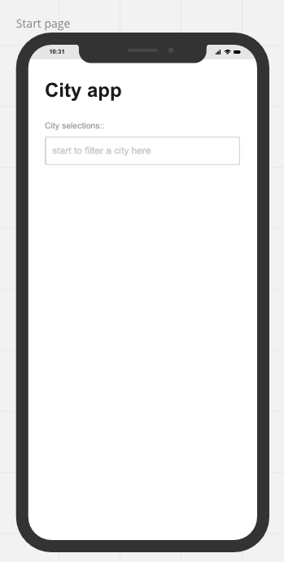
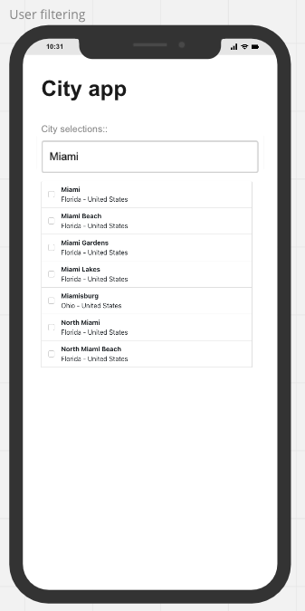
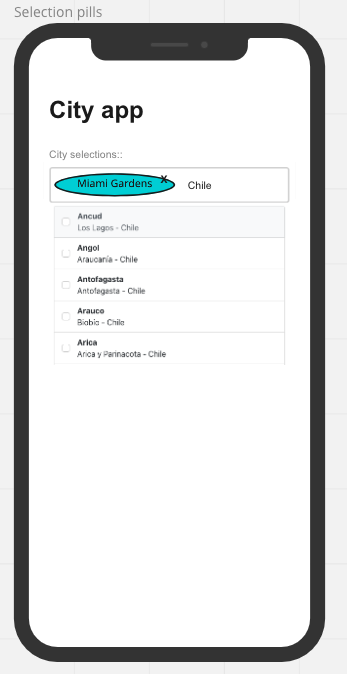

# City list mini app
Welcome to the city list mini app repository.

In this repository you can find 2 applications (on each folder):
* city-list-api: It is a mock backend required to test the single page front end app. You can read more information about this app [ here](https://github.com/raochoar/citylist/tree/main/city-list-api)
* city-list-ui: The front-end app that allows to the user to search cities and manage the checked status. Please see more details about this app [here](https://github.com/raochoar/citylist/tree/main/city-list-ui)

## How to execute the app?
1. You will need to have installed node v16 installed.
2. On both apps folders (city-list-api and city-list-ui) install the dependencies calling:
### `npm install`
3. Open a terminal and start the backend: inside the city-list-api folder execute: 
### `./api-server`
3. Open another terminal and start the front end app:
### `npm start`
4. Enjoy the app. It will be hosted in this endpoint: http://localhost:3030

# New UX alternative

The current UX has a lot of clicks to manage the status of the selection, the user needs to scroll a lot to find a city (if the filter is not specific) and also after the user clicks on a city that state is lost in the scroll area.

An alternative is to use autocomplete with pills:
1) The user start to write the filter and the list is shown as an autocomplete
   
2) The user select the city and the autcomplete is collapsed, the selection is relfected in a item inside the input text box as a pill (see Miami Gardens sample).
   
3) The user could remove the selected pill with a close icon or just the keyboard backspace key.
   
4) Finally, the user could continue filtering and adding more cities if the user continue writing city names at the search bar.

